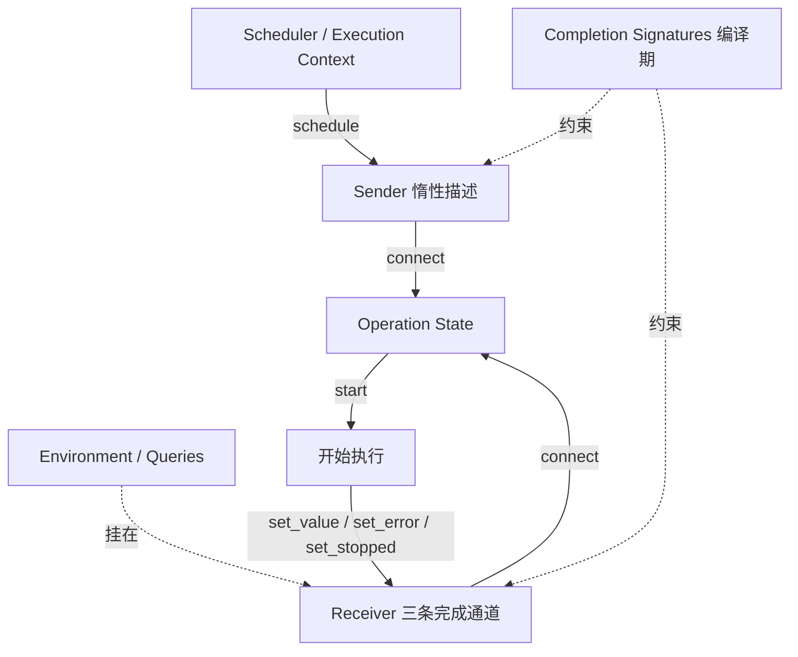
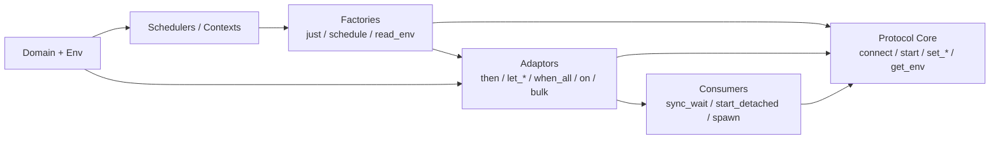
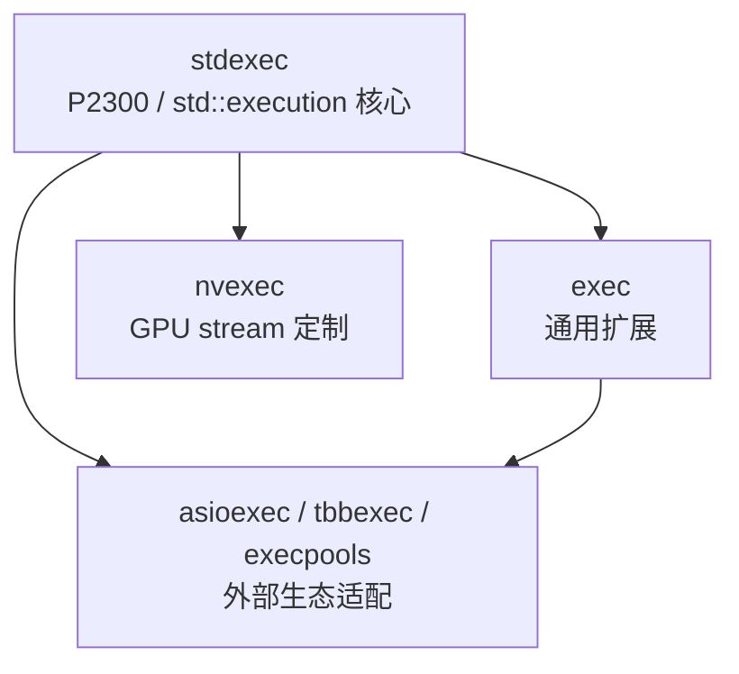

下面按 **P2300 概念模型** 和 **NVIDIA/stdexec 仓库实现分层** 两层来说明。  
结论先说：`stdexec` 是 C++26 `std::execution`（P2300 / `[exec]`）的参考实现；它不是“一堆独立库”，而是围绕 **Sender / Receiver / Operation State / Scheduler / Environment** 这套协议叠出来的算法与执行上下文生态。

---

## 1. P2300 与 stdexec 的关系

| 名字 | 是什么 |
|---|---|
| **P2300 / `[exec]`** | C++ 异步/并行编程模型提案，现已进入 C++26 的 `std::execution` |
| **stdexec** | NVIDIA 维护的 header-only 参考实现，公开入口是 [`<stdexec/execution.hpp>`](D:\project\stdexec\include\stdexec\execution.hpp) |
| **`exec` / `nvexec` 等** | 标准还没完全覆盖、或平台特化的扩展层 |

P2300 定义的是 **协议 + 算法语义**；stdexec 把这套协议落成可编译、可扩展的代码。

---

## 2. P2300 的核心模块（概念层）

文档和 reference 把模型分成三层：

### A. 基础协议四件套

1. **Scheduler（调度器）**  
   轻量 handle，指向某个执行上下文（线程池、事件循环、GPU、I/O…）  
   - 关键 CPO：`schedule(scheduler) -> sender`

2. **Sender（发送者）**  
   描述“将来可能发生的异步计算”，**惰性**，本身不做功  
   - 关键 CPO：`connect(sender, receiver) -> operation_state`  
   - 类型层：`get_completion_signatures`

3. **Receiver（接收者）**  
   消费 completion 的回调对象，三条完成通道：  
   - `set_value` / `set_error` / `set_stopped`

4. **Operation State（操作状态）**  
   `connect` 的产物，代表“已连接但尚未/正在运行”的运算  
   - 关键 CPO：`start(op)`  
   - 启动后必须活到 completion；通常不可移动

### B. 横切基础设施

5. **Environment / Queries**  
   挂在 receiver（也可挂 sender attributes）上的键值上下文：  
   stop token、allocator、scheduler、domain 等  
   - 关键 CPO：`get_env`

6. **Completion Signatures**  
   编译期描述 sender 可能发出哪些 value/error/stopped 信号

7. **Domain / `transform_sender`**  
   让特定执行上下文（如 GPU domain）**定制算法实现**，而不是写死在算法里

8. **Stop Token / Cancellation**  
   结构化取消通道，常经 environment 向下传播

9. **Coroutine Interop**  
   sender 可 `co_await`，awaitable 也可当 sender 用

### C. 算法层（用户真正组合工作流的地方）

| 类别 | 作用 | 例子 |
|---|---|---|
| **Sender factories** | 从非 sender 造 sender | `just`, `just_error`, `just_stopped`, `schedule`, `read_env` |
| **Sender adaptors** | 变换/组合 sender | `then`, `let_*`, `upon_*`, `when_all`, `bulk`, `on/starts_on/continues_on`, `write_env` |
| **Sender consumers** | 真正启动运算 | `sync_wait`, `start_detached`, `spawn` |

运行时生命周期可以压成一条链：

```text
scheduler --schedule--> sender
sender + receiver --connect--> operation_state
operation_state --start--> 执行
执行完成 --set_value/error/stopped--> receiver
receiver 带着 environment（scheduler / stop_token / allocator / domain）
```

---

## 3. stdexec 仓库的实现模块（代码层）

仓库公开表面大致是三层命名空间 + 若干适配器：

### 3.1 `stdexec`：标准面向层（P2300 核心）

路径：[`include/stdexec/`](D:\project\stdexec\include\stdexec)

| 文件/目录 | 职责 |
|---|---|
| `execution.hpp` | 总入口，聚合几乎全部核心设施 |
| `__detail/` | 真正实现：concepts / CPOs / algorithms / domain / coroutine 等 |
| `concepts.hpp` / `functional.hpp` / `coroutine.hpp` / `stop_token.hpp` | 支撑与公共配套 |

`__detail` 内部可再按职责拆：

| 子模块 | 代表文件 | 关系 |
|---|---|---|
| 元编程/配置 | `__meta.hpp`, `__config.hpp`, `__concepts.hpp` | 最底层，被几乎一切依赖 |
| 协议核心 | `__senders.hpp`, `__receivers.hpp`, `__operation_states.hpp`, `__connect.hpp` | 定义 sender/receiver/opstate 协议 |
| 类型系统 | `__completion_signatures*.hpp`, `__transform_completion_signatures.hpp` | 决定算法组合是否类型合法 |
| 环境/查询/域 | `__env.hpp`, `__queries.hpp`, `__domain.hpp`, `__transform_sender.hpp` | 定制与上下文传播 |
| 算法 | `__just.hpp`, `__then.hpp`, `__let.hpp`, `__when_all.hpp`, `__bulk.hpp`, `__on.hpp`… | 建立在协议 + signatures + domain 之上 |
| 调度 | `__schedulers.hpp`, `__run_loop.hpp`, `__inline_scheduler.hpp`, `__parallel_scheduler*.hpp` | 产出 schedule sender，并把工作推到上下文 |
| 结构化并发 | `__scope*.hpp`, `__spawn*.hpp`, `__counting_scopes.hpp` | 动态挂任务、生命周期跟踪 |
| 协程桥 | `__awaitable.hpp`, `__as_awaitable.hpp`, `__task.hpp`, `__connect_awaitable.hpp` | 双向打通 sender ↔ coroutine |
| 基础设施 | `__basic_sender.hpp`, `__receiver_adaptor.hpp`, intrusive queues… | 写 adaptor/scheduler 的通用零件 |

### 3.2 `exec`：通用扩展层

路径：[`include/exec/`](D:\project\stdexec\include\exec)

这些多半是 **有用但未完全标准化**，或实验/平台扩展：

- 结构化并发与生命周期：`async_scope`, `task`, `finally`, `ensure_started`, `when_any`
- 线程/上下文：`static_thread_pool`, `single_thread_context`, `system_context`, `trampoline_scheduler`
- 平台后端：`linux/io_uring_context`, `windows/windows_thread_pool`, `libdispatch_queue`
- 序列/流式扩展：`sequence/*`
- 与外部执行器集成：`asio/*`, `tbb/*`, `taskflow/*`

关系：**依赖 `stdexec` 协议**，不反向定义标准核心。

### 3.3 `nvexec`：NVIDIA GPU 特化层

路径：[`include/nvexec/`](D:\project\stdexec\include\nvexec)

- `stream_context` / `multi_gpu_context`：GPU 调度上下文
- `stream/*.cuh`：对 `then/let/when_all/bulk/...` 的 CUDA stream 定制实现  
- 机制上通常走 **domain customization**，让同样的算法管道在 GPU 上换实现

关系：**依赖 `stdexec` 协议与 domain 机制**，把执行落到 CUDA stream。

### 3.4 适配器/池集成

- `asioexec/`：Asio completion token ↔ sender
- `tbbexec/`、`execpools/`：线程池后端适配  
关系：外围适配层，把已有生态接到 sender 协议上。

---

## 4. 模块之间的关系图

### 4.1 概念运行时关系（P2300 协议）



### 4.2 算法分层关系



### 4.3 stdexec 仓库依赖关系



更细一点：

```text
元编程/配置
   ↓
协议核心 (sender/receiver/opstate/CPO)
   ↓
completion signatures + env/query + domain
   ↓
algorithms + schedulers + coroutine bridge + scopes
   ↓
exec 扩展 / nvexec GPU / asio·tbb 适配
```

---

## 5. 用“一次真实执行”串起来

以 README 的例子：

```cpp
auto work = when_all(
  on(sched, just(0) | then(fun)),
  on(sched, just(1) | then(fun)),
  on(sched, just(2) | then(fun)));
auto [i,j,k] = sync_wait(std::move(work)).value();
```

各模块如何协作：

1. **Scheduler 模块**：`get_parallel_scheduler()` 给执行上下文
2. **Factory**：`just(n)` 造值 sender
3. **Adaptor**：`then` 变换 value；`on` 指定在哪个 scheduler 跑并处理上下文切换
4. **组合 adaptor**：`when_all` 并行汇合
5. **Consumer**：`sync_wait` 内部 `connect + start`，阻塞等到 completion
6. 全程靠 **receiver/opstate** 接管道，靠 **env/stop_token** 传取消与上下文，靠 **completion signatures** 在编译期保证类型闭合
7. 若换成 `nvexec` scheduler，同一套算法可通过 **domain** 换成 GPU 实现

---

## 6. 怎么理解“模块边界”

可以记成三句话：

1. **P2300 的模块是协议模块**，不是业务模块：核心永远是 sender/receiver/opstate/scheduler/env。  
2. **算法是协议之上的 DSL**：factories 造管道头，adaptors 组合，consumers 点火。  
3. **stdexec 的目录模块是实现与扩展分层**：  
   - `stdexec` = 标准核心  
   - `exec` = 通用增强  
   - `nvexec` = GPU 定制  
   - `asioexec/tbbexec/execpools` = 外部系统适配

如果你愿意，我下一步可以继续只做调查，把 **P2300 标准条款** 和 **`stdexec/__detail` 文件** 做成一一对照表（例如 `[exec.snd]`、`[exec.recv]`、`[exec.opstate]`、`[exec.sched]`、`[exec.algo]` 分别落在哪些头文件）。