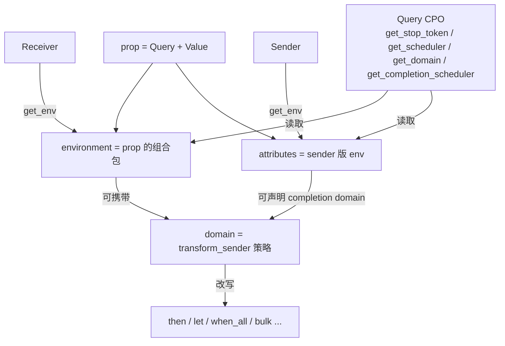

这几个概念确实是 P2300 里最“玄学”的一层。  
先给一句总览，再逐个拆开：

> **Environment 是“上下文字典”**  
> **Query 是“查字典的键”**  
> **prop 是“单个键值对”**  
> **attrs 是 sender 侧的环境/属性**  
> **domain 是“算法定制命名空间”**

它们不是业务数据，而是 **横切元数据系统**，用来回答：

- 这个运算用哪个 stop token？
- 用哪个 allocator？
- 当前 scheduler 是谁？
- 完成时会落到哪个 scheduler？
- 该用 CPU 版 `then` 还是 GPU 版 `then`？

---

## 1. 先建立一张心智图

```text
                    get_env
receiver ---------------------> environment  (运行时上下文)
                                 ^
                                 | 用 query 读取
                                 |
                          get_stop_token / get_scheduler / get_domain ...

sender ---------------------> attributes  (也通过 get_env 暴露)
                                 |
                                 | 用 query 读取
                                 |
                          get_completion_scheduler / get_completion_domain ...
```

| 名字 | 像什么 | 挂在谁身上 | 典型内容 |
|---|---|---|---|
| **environment** | 运行时上下文 bag | receiver | stop token, allocator, current scheduler, domain |
| **attributes / attrs** | sender 的“静态说明书” | sender | completion scheduler, completion domain, 是否 inline 完成 |
| **query** | 类型键 / 查询函数对象 | 两者都用 | `get_stop_token`, `get_scheduler`… |
| **prop** | 单个 `(query, value)` | 用来组装 env | `prop{get_stop_token, tok}` |
| **domain** | 算法重写策略标签 | 常经 env/attrs 发布 | GPU domain, 自定义 backend |

注意：标准里 sender 的 attributes 和 receiver 的 environment **共用同一套 query 机制**，都通过 `get_env(...)` 拿出来。只是语义不同：

- receiver env：下游/启动侧给上游看的上下文
- sender attrs：上游声明自己“完成后会怎样”

---

## 2. Query：不是数据，是“问题本身”

### 2.1 它是什么

Query 是一个 **空的 tag 类型 + 函数对象（CPO）**。  
你不是写 `env.stop_token`，而是问：

```cpp
auto tok = stdexec::get_stop_token(env);
auto sch = stdexec::get_scheduler(env);
```

在实现里，查询大致走：

```cpp
env.query(get_stop_token_t{})
// 或更完整：
get_stop_token(env)  // 内部调用 env.query(get_stop_token)
```

所以 query 同时扮演两件事：

1. **键（key）**：用类型区分不同属性  
2. **API（CPO）**：提供统一调用语法和校验

### 2.2 常见 query

| Query | 问什么 | 通常问谁 |
|---|---|---|
| `get_stop_token` | 取消令牌 | receiver env |
| `get_allocator` | 分配器 | receiver env |
| `get_scheduler` | 当前/首选 scheduler | receiver env |
| `get_domain` | 当前 domain | receiver env |
| `get_completion_scheduler<set_value_t>` | 完成后在哪个 scheduler 上继续 | sender attrs |
| `get_completion_domain<set_value_t>` | 完成后属于哪个 domain | sender attrs |
| `get_forward_progress_guarantee` | 进度保证 | scheduler/attrs |
| `forwarding_query` | 这个 query 是否应被包装层转发 | query 自身 |

### 2.3 为什么不用普通成员字段？

因为环境是 **开放集合**：

- 标准会加新 query
- 库可以加私有 query
- 你的后端也能加自定义 query

如果写成 `struct Env { stop_token st; allocator a; }`，扩展就死了。  
用 type-keyed query，就变成“谁认识这个键谁回答”。

### 2.4 forwarding query

有些 query 被中间 adaptor 包一层时应该继续透传，有些不该。  
例如 stop token / allocator 通常要转发；某些 root-only 的内部 query 不转发。  
`forwarding_query(q)` 就是用来标记这件事。

---

## 3. Environment：receiver 的上下文字典

### 3.1 定义

Environment 是一个 **无序的、用 query 类型做键的属性包**。  
每个 receiver 都有一个（可为空）env：

```cpp
auto env = stdexec::get_env(rcvr);
```

它回答的是：

> “当你在这个 receiver 上启动一个操作时，周围上下文是什么？”

### 3.2 为什么必须有它

Sender 是惰性描述。真正启动时，运算需要知道：

- 取消信号从哪来
- 临时内存从哪分配
- 后续默认调度到哪
- 有没有 domain 定制

这些信息 **不该硬塞进每个算法参数**，而是挂在 receiver 上往下传。  
于是形成：

```text
consumer 创建 receiver(env)
  -> connect(sender, receiver)
  -> start(op)
  -> 内部算法通过 get_env(rcvr) 取上下文
```

### 3.3 最小例子

```cpp
struct MyReceiver {
  using receiver_concept = stdexec::receiver_tag;
  stdexec::inplace_stop_token tok_;

  auto get_env() const noexcept {
    return stdexec::env{
      stdexec::prop{stdexec::get_stop_token, tok_}
    };
  }

  void set_value(int) noexcept {}
  void set_error(std::exception_ptr) noexcept {}
  void set_stopped() noexcept {}
};
```

这里：

- `prop{get_stop_token, tok_}` 是一个属性
- `env{...}` 是属性包
- `get_env()` 把包暴露出去

### 3.4 env 的合并规则

`env<A, B, C>` 像“分层字典”：

- 查某个 query 时，从左到右找 **第一个能回答的层**
- 前面的层可以 shadow 后面的层

`write_env` 就是这个规则的算法版：

```cpp
child | write_env(prop{get_stop_token, my_tok})
```

效果：

```text
child 看到的 env = join(my_prop_env, outer_receiver_env)
```

所以 `write_env` 是“给子管道注入/覆盖上下文”，`read_env` 是“把上下文读成 value 通道”。

---

## 4. prop：环境的原子积木

### 4.1 它是什么

`prop<Query, Value>` 就是 **单个键值对对象**：

```cpp
stdexec::prop{stdexec::get_allocator, my_alloc}
```

实现语义近似：

```cpp
template <class Query, class Value>
struct prop {
  Query __query;
  Value __value;

  auto query(Query, auto&&...) const noexcept -> Value const& {
    return __value;
  }
};
```

### 4.2 为什么单独有 prop

因为环境经常要“临时拼一个”：

```cpp
auto e = stdexec::env{
  stdexec::prop{stdexec::get_stop_token, tok},
  stdexec::prop{stdexec::get_allocator, alloc}
};
```

没有 prop，你就得为每种组合手写结构体。  
有了 prop，env 就是 prop 的组合。

### 4.3 cprop

`cprop` 是编译期常量版 prop，值写进类型里，适合 domain 这种空 tag / 常量策略。

---

## 5. Attributes：sender 的“出厂标签”

### 5.1 它和 environment 的区别

很多人一开始会混：

| | Environment | Attributes |
|---|---|---|
| 挂在 | receiver | sender |
| 回答 | 启动时上下文 | 完成后的性质/能力 |
| 典型问题 | 用谁的 stop token？ | 完成后落在哪个 scheduler？ |
| 何时更关键 | `start` / 运行时 | 编译期组合、调度切换、domain 选择 |

API 却很统一：

```cpp
auto attrs = stdexec::get_env(sndr); // sender 的 attributes
auto env   = stdexec::get_env(rcvr); // receiver 的 environment
```

### 5.2 最重要的 attrs query

- `get_completion_scheduler<set_value_t>`  
  “这个 sender 成功完成后，continuation 默认在哪个 scheduler 上？”

- `get_completion_domain<set_value_t>`  
  “这个 sender 完成后属于哪个算法定制域？”

这就是 `continues_on` / `on` / `schedule_from` 能正确切换上下文的基础。  
例如：

```cpp
schedule(gpu_sched) | then(f)
```

框架需要知道：

1. `schedule(gpu_sched)` 完成后在 GPU domain/scheduler
2. 后续 `then` 是否应被 GPU domain 改写成 GPU 实现

---

## 6. Domain：算法的“后端插件点”

### 6.1 它是什么

Domain 通常是一个 **空 tag 类型**，带 `transform_sender`：

```cpp
struct my_domain {
  template <class OpTag, class Sender, class Env>
  auto transform_sender(OpTag, Sender&& sndr, Env const& env) const {
    // 可选择：原样返回，或重写成另一个 sender
    return std::forward<Sender>(sndr);
  }
};
```

默认是 `default_domain`：多数情况不改写，最多回退到算法 tag 自己的默认变换。

### 6.2 解决什么问题

你写：

```cpp
sndr | then(f) | when_all(...) | bulk(...)
```

同一个算法表达式，在不同执行上下文可能要不同实现：

- CPU 线程池：普通 C++ 实现
- CUDA stream：kernel / stream callback 实现
- 某个定制 runtime：自家队列实现

如果让用户写：

```cpp
gpu_then(...)
cpu_then(...)
```

组合性就崩了。  
Domain 的目标是：

> **用户仍写 `then`，框架根据当前 domain 选实现。**

### 6.3 domain 从哪来

通常两条路：

1. **Starting domain**  
   从 receiver env 的 `get_domain` 读  
   意思：最终消费者/启动上下文说“按我的 backend 启动”

2. **Completing domain**  
   从 sender attrs 的 `get_completion_domain<set_value_t>` 读  
   意思：前驱完成后属于哪个 backend

框架在 `connect` 前大致做：

```text
sndr
  -> completing_domain.transform_sender(set_value, sndr, env)
  -> starting_domain.transform_sender(start, sndr', env)
  -> 真正 connect
```

所以 domain 是 **编译期/连接期的重写器**，不是 runtime 调度器本身。

### 6.4 domain vs scheduler

| | Scheduler | Domain |
|---|---|---|
| 管什么 | 工作跑在哪个执行资源上 | 算法如何被实现/改写 |
| 产物 | `schedule()` 得到 sender | `transform_sender` 改写算法树 |
| 例子 | thread pool, CUDA stream | `default_domain`, GPU domain |
| 关系 | 常发布自己的 domain | 可依赖 scheduler 提供的上下文 |

一句话：

- scheduler 回答 **where**
- domain 回答 **how the algorithm is lowered**

---

## 7. `read_env` / `write_env`：把 env 接进管道语言

### `read_env(query)`

把 env 查询变成 sender 的 value：

```cpp
auto s = stdexec::read_env(stdexec::get_stop_token)
       | stdexec::then([](auto tok){
           return tok.stop_requested();
         });
```

语义：

```text
start 时：
  value = query(get_env(receiver))
  set_value(receiver, value)
```

常见糖：

```cpp
get_stop_token()   // ~ read_env(get_stop_token)
get_scheduler()
get_allocator()
```

### `write_env(env_or_prop)`

给子管道注入上下文：

```cpp
auto s = inner
       | stdexec::write_env(
           stdexec::prop{stdexec::get_stop_token, src.get_token()});
```

语义：

```text
child 看到的 env = join(写入的 env, 外层 receiver env)
```

用途：

- 给子任务换 stop token
- 注入 allocator
- 注入 domain / scheduler 相关上下文

一对反义词：

- `read_env`：env -> value channel
- `write_env`：value-ish context -> child env

---

## 8. 一次完整故事：这些概念如何协作

看这段：

```cpp
auto work =
    stdexec::schedule(gpu)
  | stdexec::then(kernel_like)
  | stdexec::continues_on(cpu)
  | stdexec::then(postprocess);

stdexec::sync_wait(std::move(work));
```

幕后大致是：

1. `sync_wait` 构造 receiver，带 root environment（可能含 stop token 等）
2. `schedule(gpu)` 的 attrs 声明：
   - completion scheduler = gpu
   - completion domain = gpu_domain
3. 连接 `then(kernel_like)` 时，framework 看到当前 domain 是 GPU，可能把 `then` 改写成 GPU 版
4. `continues_on(cpu)` 读取前驱 completion scheduler/domain，安排跨上下文切换
5. 后半段 `then(postprocess)` 在 CPU domain 上走普通实现
6. 全程取消/分配等，通过 receiver env 的 query 向下传播

没有 env/query/attrs/domain，这套“同一套算法、多种 backend”几乎做不成。

---

## 9. 用生活类比压一遍

把异步管道想成快递系统：

- **Sender**：运单（描述要做的事）
- **Receiver**：收件人回调
- **Operation state**：已经揽收、正在运输的包裹状态
- **Scheduler**：分拨中心/车队
- **Environment**：运单附带的运行时备注  
  （取消电话、包装材料预算、默认下一站）
- **Query**：备注条目名  
  （“取消电话是谁？”“预算账户是谁？”）
- **prop**：一条备注贴纸
- **Attributes**：发件侧打印在运单上的能力标签  
  （“到货后会在浦东分拨中心完成”）
- **Domain**：操作规程手册  
  （同样“分拣”动作，航空件和陆运件流程不同）

---

## 10. 最容易混淆的点

1. **env 不是 sender 的输入参数列表**  
   它是隐式上下文，类似 coroutine promise / thread-local 的类型安全版。

2. **attrs 和 env 共用 query 机制，但方向不同**  
   - env：下游告诉上游“你现在处在什么上下文”  
   - attrs：上游告诉下游“我完成后是什么性质”

3. **domain 不是执行线程**  
   它不跑代码，只决定算法树如何被改写。

4. **prop 本身不是完整 env**  
   它是原子属性；`env{prop...}` 才是包。

5. **你平时写业务代码，很少手搓 domain**  
   你更常：
   - 用 `get_scheduler` / `get_stop_token`
   - 偶尔 `write_env`
   - 选不同 scheduler（CPU/GPU/io_uring）  
   domain 主要是 backend 作者的工具。

---

## 11. 一张关系总图



---

## 12. 你只要先记住这 5 句

1. **Query = 问题（类型键）**  
2. **prop = 一个答案条目**  
3. **environment = receiver 的答案本**  
4. **attributes = sender 的说明书**  
5. **domain = 根据上下文改写算法实现的插件标签**

如果你愿意，我下一步可以继续只讲这一层，用一个最小可编译例子手写：

- 自定义 receiver + env + prop
- `read_env` / `write_env`
- 一个会改写 `then` 的 toy domain

这样会比纯概念更快“长进肌肉记忆”。