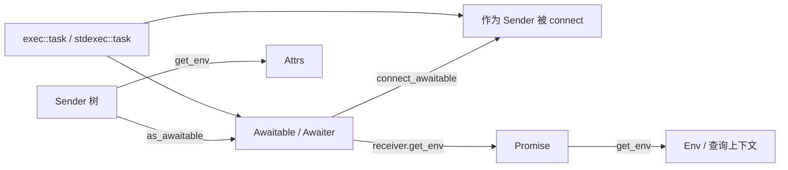

协程是 execution 框架的**第三张脸**：同一套异步语义，可以用 sender 组合、receiver 完成通道，也可以用 `co_await` / `co_return` 写。stdexec 做的不是“把协程塞进框架”，而是在两侧各建一座桥。

## 一句话模型

```text
协程 suspend/resume  ←→  sender 的 connect/start + set_value/error/stopped
promise.get_env()    ←→  receiver 的 env（运行时上下文）
sender 的 get_env()  ←→  attrs（描述这个 sender 本身）
```

| 协程世界 | execution 世界 | 映射 |
|---|---|---|
| `co_await X` | 启动一个异步操作并等结果 | `as_awaitable` / `__sender_awaiter` |
| `await_resume()` 返回值 | `set_value(...)` | 值通道 |
| 异常 / `unhandled_exception` | `set_error(exception_ptr)` | 错误通道 |
| `unhandled_stopped()` | `set_stopped()` | 取消通道 |
| promise 的 `get_env()` | receiver env | 调度器、stop token 等 |
| task 本身 | awaitable，也常是 sender | 双向可用 |

## 总览：两座桥 + 一个统一体

```text
路径 A:  sender  → awaitable
         co_await sndr
         as_awaitable / __sender_awaiter

路径 B:  awaitable → sender
         connect(awaitable, receiver)
         __connect_awaitable

路径 C:  task / basic_task
         既是可 co_await 的协程，也能作为 sender 被 connect
```



---

## 路径 A：`co_await sender`

### 1. 入口：`await_transform` → `as_awaitable`

promise 继承 `with_awaitable_senders` 后：

```cpp
// with_awaitable_senders
template <class Value>
auto await_transform(Value&& val) {
  return as_awaitable(std::forward<Value>(val), static_cast<Promise&>(*this));
}
```

于是：

```cpp
co_await (schedule(sch) | then(f));
// 实际变成
co_await as_awaitable(that_sender, promise);
```

### 2. `as_awaitable` 的优先级（谁先匹配谁赢）

来自 `__as_awaitable.hpp`：

1. **成员** `x.as_awaitable(promise)` —— 类型自己知道怎么被 await
2. **`transform_sender` 后再 `as_awaitable`** —— 先按 promise env 做 domain 改写
3. **本来就是 awaitable** —— 原样返回
4. **通用 sender 包装** → `__sender_awaiter`
5. 不兼容 sender → 编译期错误类型
6. 其它 → 原样返回

注意第 2、4 步都会用 **promise 的 env** 做 `transform_sender`。domain 在协程里仍然生效：`co_await then(...)` 和 `connect(then(...), rcvr)` 走同一套改写规则。

### 3. 通用路径：`__sender_awaiter` 在干什么

```text
构造时:
  connect(sender, special_receiver) → opstate
  （若已知 inline complete，可延后到 await_suspend 再 connect）

await_ready:
  通常 false

await_suspend:
  start(opstate)
  若同线程已经完成 → 直接返回 continuation
  否则 → noop_coroutine，等别的线程 resume

receiver 完成时:
  set_value(vs...)  → 存进 result variant
  set_error(e)      → 变成 exception_ptr 存进 variant
  set_stopped()     → result 保持 valueless

await_resume:
  error → rethrow
  value → 返回（void 则无返回值）
  stopped → 根本不 resume 本协程，走 unhandled_stopped
```

### 4. 完成通道 ↔ 协程语义（这是最关键的映射）

| sender 完成 | awaiter 行为 | 协程看到什么 |
|---|---|---|
| `set_value(x...)` | 存值，resume | `await_resume()` 得到值（0 个值→void，多个值→tuple） |
| `set_error(e)` | 转 `exception_ptr`，resume | `await_resume` rethrow |
| `set_stopped()` | result 为空，**不正常 resume** | 调用 promise 的 `unhandled_stopped()`，沿调用链向上“取消展开” |

这就是为什么 `coroutine.hpp` 里有 `__coroutine_handle` 和 `unhandled_stopped()`：取消不是 C++ 异常，必须单独一条协议。

### 5. env 怎么流进被 await 的 sender

`__sender_awaiter` 的 receiver：

```cpp
auto get_env() const noexcept -> env_of_t<Promise&> {
  auto h = coroutine_handle<Promise>::from_address(...);
  return stdexec::get_env(h.promise());
}
```

所以：

```text
promise.get_env()
   ↓  作为 receiver env
sender 在 connect/start 时查询
   get_scheduler / get_stop_token / get_allocator / domain ...
```

**attrs 仍然是 sender 自己的 `get_env(sndr)`**，描述 completion scheduler、completion domain 等；`as_awaitable` 可能先用 promise env 做 `transform_sender`，但 attrs 不会变成 promise env。

---

## 路径 B：awaitable 当作 sender

### 1. 为什么 awaitable 可以是 sender？

`sender` 概念默认允许：

```cpp
// __sender_concepts.hpp
enable_sender<S> =
    has sender_concept
 || awaitable<S, promise<env<>>>;   // awaitable 自动 opt-in
```

于是很多 coroutine awaitable **不用写 `sender_concept`** 也能进算法管道（再配合 completion signatures）。

### 2. `connect(awaitable, receiver)` 走 `__connect_awaitable`

`connect` 的候选顺序里有 `__with_co_await`：

```cpp
// 若没有成员 connect，但 awaitable 在特定 promise 下可 await
→ __connect_awaitable(awaitable, receiver)
```

### 3. 内部状态机

`__connect_awaitable` 构造一个 **合成 coroutine frame**（不是用户协程）：

```text
opstate.start():
  构造 awaitable/awaiter
  if (!await_ready())
    await_suspend(synthetic_coro_handle)
  else
    直接 on_resume

on_resume:
  try:
    v = await_resume()
    set_value(rcvr, v)   // 或 set_value(rcvr) if void
  catch:
    set_error(rcvr, current_exception())

promise.unhandled_stopped():
  set_stopped(rcvr)
  return noop_coroutine
```

### 4. 这条路径上的 env

合成 promise：

```cpp
auto get_env() const noexcept -> env_of_t<Receiver> {
  return get_env(opstate.receiver);
}
```

也就是：

```text
receiver env  →  “驱动 awaitable 的假 promise 的 env”
             →  若 awaitable 内部再 as_awaitable(sender)
             →  那个 sender 看到的还是这个 receiver env
```

### 5. completion signatures 怎么算

awaitable-as-sender 的签名被推导为：

```cpp
completion_signatures<
  set_value_t( await_result_t<Awaitable, promise<Env>> ), // 或 void
  set_error_t(exception_ptr),
  set_stopped_t()
>
```

含义很直白：

- resume 返回值 → value
- 异常 → error
- 取消协议 → stopped

---

## 路径 C：`task` —— 两边都是

### 1. 两种 task

| | `stdexec` 侧 `__detail/__task.hpp` | `exec::task` (`include/exec/task.hpp`) |
|---|---|---|
| 定位 | 更贴近标准方向的 task 实验 | 扩展库里更“完整”的 task |
| 身份 | 明确是 **sender**（`sender_concept`） | 主要是 **awaitable**；经 connect_awaitable 也可当 sender |
| affinity | `affine(...)` 粘调度器 | sticky context + `continues_on` |
| stop | 自己的状态机 + parent env | `inplace_stop_token` 转发 parent stop |

你日常写业务，更常碰到 `exec::task<T>`。

### 2. `exec::task` 的 promise 职责

```cpp
struct promise
  : promise_base<T>
  , with_awaitable_senders<promise>
{
  get_return_object()     → basic_task{handle}
  initial_suspend()       → always  // lazy：创建 task 不跑
  final_suspend()         → 恢复 parent continuation
  unhandled_exception()   → 存 exception_ptr
  // unhandled_stopped 通过 with_awaitable_senders + continuation 向上传

  get_env() → *context_   // stop token + start scheduler ...

  await_transform(sender):
    if (sender 会在启动处完成)
      as_awaitable(sndr)
    else
      as_awaitable(continues_on(sndr, get_start_scheduler(*context_)))
};
```

### 3. sticky scheduler affinity（为什么 task 要“粘”调度器）

默认 context 是 sticky：

- 从 parent promise 读 `get_start_scheduler(get_env(parent))`
- 之后 `co_await` 的 sender，若可能跑到别的执行资源上完成，就自动包一层 `continues_on(start_scheduler)`
- 结果：`co_await` 回来后，协程体仍在“原来的 start scheduler”上继续

这解决的是：

```cpp
// 没有 affinity 时很容易踩坑
co_await schedule(pool) | then(...);  // 可能在 pool 线程 resume
// 后面访问 thread-local / 非线程安全状态就炸了
```

### 4. 子 task 被 `co_await` 时发生了什么

`basic_task::as_awaitable(ParentPromise&)` / `operator co_await`：

```text
await_suspend(parent):
  child.context = 从 parent 构造（拷 start scheduler，接 stop token）
  child.set_continuation(parent)
  若已 stop → 直接 unhandled_stopped(parent)
  否则 resume child

child final_suspend:
  resume parent continuation

await_resume:
  有 exception → rethrow
  有 value → 返回
  销毁 child 帧
```

stop 转发规则（awaiter context）：

| parent stop token | 行为 |
|---|---|
| `inplace_stop_token` | 直接共享 |
| 可停止的其它 token | 装 callback，转到 child 的 `inplace_stop_source` |
| unstoppable | 不转发 |

### 5. task 当 sender 用时

- **`stdexec::task`**：自带 `sender_concept`、completion signatures、`connect`/`as_awaitable`
- **`exec::task`**：作为 awaitable，走路径 B 的 `__connect_awaitable`  
  于是 `sync_wait(my_task())`、`spawn(my_task(), token)` 这类用法成立

---

## Promise / Env / Attrs 在协程里各自管什么

这是最容易混的一块，分开看：

### 角色表

| 对象 | 谁拥有 | 回答什么问题 | 协程里的典型内容 |
|---|---|---|---|
| **promise** | 协程帧 | 如何 suspend/resume、如何 transform await、如何处理 stopped/exception | `await_transform`、`get_env`、`unhandled_stopped`、`return_value` |
| **env** | receiver / promise | *当前这次执行* 的上下文 queries | `get_stop_token`、`get_scheduler` / `get_start_scheduler`、allocator、domain |
| **attrs** | sender | *这个异步操作本身* 的静态/半静态属性 | `get_completion_scheduler`、completion domain、completion behavior |

### 数据流

```text
                    ┌──────────────────────────────┐
                    │ parent receiver / parent task │
                    │ env: stop, start_scheduler…   │
                    └──────────────┬───────────────┘
                                   │ get_env(parent)
                                   ▼
                    ┌──────────────────────────────┐
                    │ child promise / task context  │
                    │ get_env() → 自己的 env 视图    │
                    └──────────────┬───────────────┘
           co_await sender          │
                                   ▼
              as_awaitable 用 promise env 做 transform_sender
                                   │
                                   ▼
              connect(sender, awaiter_receiver)
              awaiter_receiver.get_env() == promise.get_env()
                                   │
                    sender 自己仍有 attrs = get_env(sender)
                    （completion scheduler / domain 等）
```

### 记忆法

- **attrs**：sender 的“说明书”（完成后大概在哪、什么 domain、是否 inline）
- **env**：运行时“插座”（现在有什么 stop token、当前 scheduler 是谁）
- **promise**：协程的“接线板”（把 env 暴露出去，把 sender 变成 awaitable，把 stopped 往上抛）

---

## 一个完整小例子（两条路径合在一起）

```cpp
namespace ex = stdexec;
namespace sx = experimental::execution; // exec::task 所在实验命名

sx::task<int> compute(ex::scheduler auto sch) {
  // 1) co_await sender：路径 A
  int x = co_await (ex::schedule(sch) | ex::then([] { return 40; }));

  // 2) 再 co_await 另一个 sender
  int y = co_await (ex::just(2) | ex::then([](int v) { return v; }));

  co_return x + y; // set_value 语义的协程版
}

int main() {
  ex::static_thread_pool pool{2}; // 概念示例
  auto sch = pool.get_scheduler();

  // 3) task 作为 awaitable-sender：路径 B / C
  // sync_wait 会 connect(task, receiver)，内部走 awaitable 状态机
  auto [v] = ex::sync_wait(compute(sch)).value();
  // v == 42
}
```

逐步展开 `co_await (schedule(sch) | then(...))`：

1. `task::promise::await_transform(sndr)`  
   - sticky：必要时包 `continues_on(start_scheduler)`
2. `as_awaitable(sndr, promise)`  
   - 可能 `transform_sender(sndr, get_env(promise))`
3. 得到 `__sender_awaiter`
4. `await_suspend` → `start(opstate)`
5. sender 在 `sch` 上跑 `then`
6. `set_value(40)` → 存结果 → resume 协程（sticky 时先回到 start scheduler）
7. `await_resume()` 得到 `40`

`sync_wait(compute(...))`：

1. `compute()` 返回 lazy `task`（`initial_suspend = always`）
2. `connect(task, sync_wait_receiver)`  
   - task 作为 awaitable → `__connect_awaitable`
3. `start` 后真正 resume task 协程
4. task `co_return 42` → 合成路径 `set_value(42)` → `sync_wait` 拿到结果

---

## 和你之前概念的短交叉链接

- **domain**：`as_awaitable` 前会 `transform_sender(..., promise_env)`，所以 `co_await then(...)` 仍可被 GPU/CPU domain 改写；domain 不是协程特例。
- **delegation / sync_wait**：`sync_wait` 给 receiver 的 env 提供 `get_delegation_scheduler`（内部 `run_loop`）。task 若查询 scheduler/stop，看到的是这条 env 链，不是“协程魔法”。
- **scope/spawn**：`spawn(task(), token)` 是把 task 当 sender 丢进 scope；协程帧的寿命由 scope/operation state 管，不是 `co_await` 自动管。

---

## 常见坑

1. **promise 必须实现 `unhandled_stopped()`**  
   否则 sender 取消路径会 `terminate`（`__coroutine_handle` 里写死了）。
2. **错误变成异常**  
   `set_error` 在 await 路径通常变成 `exception_ptr` 再 rethrow；不是继续走 error 通道的“静默分支”。
3. **lazy**  
   `task` 默认 `initial_suspend_always`：创建对象不跑；`connect+start` 或 `co_await` 才启动。
4. **affinity**  
   sticky task 会偷偷 `continues_on`；如果你以为 resume 线程等于 completion 线程，会误判。
5. **attrs ≠ promise env**  
   查 completion scheduler 看 sender attrs；查当前 stop token 看 promise/receiver env。
6. **多值 sender**  
   `as_awaitable` 要求 value 通道可压成 0/1 个值（多个会打成 tuple 一类单值）；不是任意 completion signatures 都优雅可 await。

---

## 源码锚点（本地 stdexec）

- awaitable 概念：[`D:\project\stdexec\include\stdexec\__detail\__awaitable.hpp`](D:\project\stdexec\include\stdexec\__detail\__awaitable.hpp)
- sender→awaitable：[`D:\project\stdexec\include\stdexec\__detail\__as_awaitable.hpp`](D:\project\stdexec\include\stdexec\__detail\__as_awaitable.hpp)
- awaitable→sender：[`D:\project\stdexec\include\stdexec\__detail\__connect_awaitable.hpp`](D:\project\stdexec\include\stdexec\__detail\__connect_awaitable.hpp)
- promise mixin：[`D:\project\stdexec\include\stdexec\__detail\__with_awaitable_senders.hpp`](D:\project\stdexec\include\stdexec\__detail\__with_awaitable_senders.hpp)
- stopped 传播句柄：[`D:\project\stdexec\include\stdexec\coroutine.hpp`](D:\project\stdexec\include\stdexec\coroutine.hpp)
- `exec::task`：[`D:\project\stdexec\include\exec\task.hpp`](D:\project\stdexec\include\exec\task.hpp)
- sender 概念对 awaitable 的 opt-in：[`D:\project\stdexec\include\stdexec\__detail\__sender_concepts.hpp`](D:\project\stdexec\include\stdexec\__detail\__sender_concepts.hpp)

---

## 收束

协程融入 execution 的本质不是“另起一套模型”，而是：

1. **完成三通道** ↔ **resume / exception / unhandled_stopped**
2. **promise.get_env()** 充当 **receiver env 的桥**
3. **as_awaitable** 让 sender 进入 `co_await`
4. **connect_awaitable** 让 awaitable 进入 `connect/start`
5. **task** 把两边焊成同一种业务写法：用协程写控制流，用 sender 写组合与执行资源

如果你下一步想继续挖，最有收益的两个点是：  
（1）`stdexec::task` 的 `affine` 和 `exec::task` 的 sticky `continues_on` 差在哪；  
（2）`unhandled_stopped` 在多层 `co_await task` 调用栈上的完整展开时序。