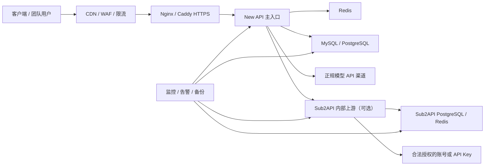

下面给你一套可以直接执行的 AI API 中转站 SOP。先澄清一下：你听说的“SubAPI”大概率是 **Sub2API**，它与 New API 不是简单的二选一，两者的定位有明显区别。

## 一、先确定选型

|方案|核心定位|上游来源|适合场景|复杂度|
|---|---|---|---|---|
|New API|通用 AI API 网关、用户、令牌、额度和渠道管理|正规 API Key、企业上游接口|自用、团队内部、给客户分配 Key|低到中|
|Sub2API|将 AI 订阅配额、OAuth 账号或 API Key 统一分发|OAuth/订阅账号/API Key|Codex、Claude、Gemini 等订阅账号统一管理|中到高|
|New API + Sub2API|New API 作为门户和计费入口，Sub2API 作为内部上游|两者结合|多用户、需要充值计费、账号池和多模型统一入口|高|

New API 负责“前台”：用户、令牌、额度、渠道、倍率、模型映射和统计；Sub2API 更偏“后端资源池”：账号、订阅配额、OAuth、调度及 API 转换。New API 的渠道可以配置自定义 Base URL，因此可以将 Sub2API 注册为它的一个内部上游。([docs.newapi.ai](https://docs.newapi.ai/zh/docs/guide/feature-guide/admin/channel))

我的建议是：

- **个人自用或公司内部使用**：只部署 New API。
- **已有正规 API Key，需要给团队分 Key**：只部署 New API。
- **主要管理 Codex、Claude、Gemini 等订阅账号**：部署 Sub2API。
- **要做完整平台**：New API 对外，Sub2API 只在内网作为上游。
- **第一次搭建**：先完成 New API MVP，不要一开始堆两个系统。

---

# 二、推荐的生产架构

````

````

域名建议：

- `api.example.com`：New API 用户后台和 API 入口
- `sub-internal.example.com`：Sub2API；只允许 New API 服务器访问
- `status.example.com`：状态页，可选
- `docs.example.com`：用户文档，可选

不要让 New API、Sub2API、MySQL、PostgreSQL、Redis 端口全部暴露到公网。公网原则上只开放：

- `22`：SSH，最好限制来源 IP
- `80`：跳转 HTTPS
- `443`：API 和控制台

数据库和 Redis 只使用 Docker 内网或私有网络。

---

# 三、上线前置检查 SOP

## 1. 确定服务边界

在部署前填写这张表：

|项目|要确认的内容|
|---|---|
|服务对象|个人、公司员工、企业客户、公众用户|
|上游授权|上游是否允许代理、共享、转售|
|模型范围|OpenAI、Anthropic、Gemini、DeepSeek 等|
|计费方式|免费、成本分摊、预付费、按量收费|
|数据位置|请求和日志是否包含个人或企业敏感数据|
|日志策略|保存什么、保存多久、谁能读取|
|故障目标|可接受的停机时间和数据丢失量|
|日调用量|RPM、并发数、每日 token 数|
|注册方式|管理员邀请、企业 SSO、公开注册|
|支付方式|无支付、人工充值、合规支付渠道|

尤其注意：**有权使用 API，不一定等于有权将 API 转售或将个人订阅共享给其他用户。**

New API 官方也将项目定位为合法授权的 API 网关、内部管理和私有化部署工具，并明确要求渠道必须是部署方合法拥有或获得授权的账号、API Key 或企业合约。([newapi.ai](https://www.newapi.ai/zh/docs/legal/acceptable-use))

## 2. 服务器准备

MVP 推荐：

- 海外 Linux VPS，Ubuntu/Debian
- 2–4 vCPU
- 4–8 GB 内存
- 50 GB 以上 SSD
- 独立 IPv4
- Docker Engine 和 Docker Compose v2
- 域名和 TLS 证书
- 对象存储或另一台服务器用于异地备份

如果有大量流式输出，主要瓶颈常常是：

- 并发连接数
- 带宽
- 上游响应时间
- Nginx/CDN 流式传输配置
- 数据库用量日志写入
- 上游限流，而不只是 CPU

---

# 四、New API 部署 SOP

官方将 Docker Compose 定位为包含 MySQL、Redis 等依赖的生产部署方式；单容器加 SQLite 更适合个人或小规模场景。([newapi.ai](https://www.newapi.ai/zh/docs/installation/deployment-methods/docker-compose-installation))

## 1. 获取项目

```
sudo mkdir -p /opt/ai-gateway
sudo chown "$USER":"$USER" /opt/ai-gateway
cd /opt/ai-gateway

git clone https://github.com/QuantumNous/new-api.git
cd new-api
```

不要直接执行网上来历不明的一键脚本。至少要先查看：

- `docker-compose.yml`
- 镜像来源
- 容器权限
- 挂载目录
- 暴露端口
- 数据库密码
- 环境变量

## 2. 修改生产配置

项目自带 Compose 文件包含 New API、MySQL 和 Redis，可在此基础上修改。([newapi.ai](https://www.newapi.ai/zh/docs/installation/deployment-methods/docker-compose-installation))

生产环境至少处理这些配置：

```
数据库 root 密码
New API 数据库用户和密码
SESSION_SECRET
CRYPTO_SECRET
Redis 密码或私有网络隔离
TZ=Asia/Shanghai
容器重启策略
数据卷路径
镜像版本
New API 监听地址
```

密钥生成示例：

```
openssl rand -hex 32
openssl rand -hex 32
openssl rand -base64 48
```

建议：

- 不要把密码提交到 Git。
- 使用独立 `.env` 文件并设置为 `chmod 600`。
- 不要使用示例密码。
- 不要把 MySQL 和 Redis 映射到 `0.0.0.0`。
- 不要长期使用浮动的 `latest` 版本；测试通过后固定版本或镜像 digest。
- 多实例时必须统一 `SESSION_SECRET`；如果共享 Redis，还要正确设置 `CRYPTO_SECRET`。([hub.docker.com](https://hub.docker.com/r/calciumion/new-api))

## 3. 启动与检查

```
docker compose pull
docker compose up -d
docker compose ps
docker compose logs --tail=100 new-api
```

官方默认入口为：

```
http://服务器IP:3000
```

首次访问会进入初始化流程并创建管理员。([newapi.ai](https://www.newapi.ai/zh/docs/installation/deployment-methods/docker-compose-installation))

验收要求：

- New API 容器为 healthy/running。
- 数据库、Redis 正常。
- 初始化页面可打开。
- 管理员登录正常。
- 重启容器后数据仍在。
- 从公网无法访问数据库和 Redis。

## 4. 初始化管理员

完成首次初始化后立即：

1. 创建高强度管理员密码。
2. 如果版本支持，启用管理员二次验证。
3. 关闭公开注册。
4. 关闭不需要的登录方式。
5. 检查默认兑换码、邀请、支付设置。
6. 设置站点名称和公告。
7. 不使用管理员令牌执行普通 API 请求。
8. 创建一个普通测试用户。

## 5. 添加正规上游渠道

New API 中进入：

```
控制台 → 渠道 → 添加渠道
```

填写：

- 渠道类型
- 渠道名称
- 上游 API Key
- Base URL
- 支持模型
- 优先级
- 权重
- 模型映射
- 自动禁用策略

New API 支持优先级、权重、模型映射、参数覆盖、自动禁用和多 Key 轮询。([docs.newapi.ai](https://docs.newapi.ai/zh/docs/guide/feature-guide/admin/channel))

推荐的渠道分层：

|优先级|用途|
|---|---|
|100|官方或企业级主渠道|
|50|正规备用渠道|
|10|高延迟或高成本应急渠道|
|0|测试渠道，默认禁用|

不要把不同价格、不同能力但名称相同的模型无脑映射到一起。例如，不同供应商的“同名模型”可能在：

- 上下文长度
- 工具调用
- 图像输入
- JSON Schema
- reasoning 参数
- 缓存计费
- 流式事件格式

上存在差异。

## 6. 配置模型与价格

为每一个公开模型建立一条“模型登记记录”：

|字段|示例|
|---|---|
|用户侧模型名|`gpt-standard`|
|实际上游模型|供应商真实模型名称|
|输入价格|按官方或合同价格|
|输出价格|按官方或合同价格|
|缓存价格|单独记录|
|上下文长度|实测和文档双重确认|
|是否支持图片|是/否|
|是否支持工具|是/否|
|备用渠道|渠道 B|
|最后核价时间|具体日期|

不要只凭 New API 内置倍率长期计费。模型定价变化后，旧倍率可能失准。

上线前执行三个测试：

```
1. 100 token 左右的小请求
2. 1000–5000 token 的普通请求
3. 含流式输出、工具调用或图像输入的复杂请求
```

对比：

```
用户扣费
New API 统计 token
上游账单 token
真实货币成本
```

如果四者偏差明显，停止上线，先修正倍率或 token 统计。

---

# 五、Nginx 与 HTTPS SOP

New API 容器端口建议只绑定本机：

```
127.0.0.1:3000:3000
```

Nginx 示例：

```
server {
    listen 80;
    server_name api.example.com;
    return 301 https://$host$request_uri;
}

server {
    listen 443 ssl http2;
    server_name api.example.com;

    ssl_certificate     /etc/letsencrypt/live/api.example.com/fullchain.pem;
    ssl_certificate_key /etc/letsencrypt/live/api.example.com/privkey.pem;

    client_max_body_size 50m;

    location / {
        proxy_pass http://127.0.0.1:3000;
        proxy_http_version 1.1;

        proxy_set_header Host $host;
        proxy_set_header X-Real-IP $remote_addr;
        proxy_set_header X-Forwarded-For $proxy_add_x_forwarded_for;
        proxy_set_header X-Forwarded-Proto $scheme;

        proxy_set_header Connection "";
        proxy_buffering off;
        proxy_cache off;

        proxy_read_timeout 600s;
        proxy_send_timeout 600s;
        send_timeout 600s;
    }
}
```

重点是：

- API 流式输出关闭代理缓冲。
- 超时时间不能过短。
- 保留真实客户端 IP。
- 限制上传体积。
- 管理后台和 API 可以进一步按路径设置不同限流。
- CDN 必须确认支持 SSE/流式响应，不要缓存 `/v1/*`。

部署后验证：

```
curl -I https://api.example.com
```

API 兼容性测试：

```
curl https://api.example.com/v1/models \
  -H "Authorization: Bearer sk-your-user-token"
```

聊天测试：

```
curl https://api.example.com/v1/chat/completions \
  -H "Authorization: Bearer sk-your-user-token" \
  -H "Content-Type: application/json" \
  -d '{
    "model": "你的模型名",
    "messages": [
      {"role": "user", "content": "只回复 OK"}
    ],
    "stream": false
  }'
```

---

# 六、Sub2API 部署 SOP

Sub2API 当前官方仓库的名称是 `Wei-Shaw/sub2api`。截至 **2026 年 7 月 10 日**，GitHub Releases 页面显示的最新版本为 `0.1.151`；版本更新很频繁，因此生产环境不要自动追随 `latest`，应先在测试环境验证再升级。([github.com](https://github.com/Wei-Shaw/sub2api/releases))

## 1. 推荐部署方式

官方提供：

- Linux 一键二进制安装
- Docker Compose
- 手动编译

Docker Compose 会包含 PostgreSQL 和 Redis，适合隔离和迁移；官方部署文档要求 Docker 20.10+、Compose v2+。([github.com](https://github.com/Wei-Shaw/sub2api/blob/main/README_CN.md))

建议使用：

```
Docker Compose + PostgreSQL + Redis + 固定版本镜像
```

## 2. 获取配置

```
sudo mkdir -p /opt/sub2api
sudo chown "$USER":"$USER" /opt/sub2api
cd /opt/sub2api

git clone https://github.com/Wei-Shaw/sub2api.git source
cd source/deploy
cp .env.example .env
```

必须设置：

```
POSTGRES_PASSWORD
JWT_SECRET
TOTP_ENCRYPTION_KEY
```

官方的一键准备脚本会自动生成这些秘密并创建 PostgreSQL、Redis 和数据目录；手动部署时应自行使用安全随机数生成。([github.com](https://github.com/Wei-Shaw/sub2api/blob/main/deploy/README.md))

例如：

```
openssl rand -hex 32
openssl rand -hex 32
openssl rand -base64 36
```

## 3. 启动

按照仓库当前 Compose 文件名执行，例如：

```
docker compose -f docker-compose.local.yml pull
docker compose -f docker-compose.local.yml up -d
docker compose -f docker-compose.local.yml ps
docker compose -f docker-compose.local.yml logs --tail=100 sub2api
```

官方文档中 Web UI 默认示例是：

```
http://localhost:8080
```

随后完成：

- PostgreSQL 配置
- Redis 配置
- 管理员创建
- 上游资源配置

这些步骤由初始化向导引导完成。([github.com](https://github.com/Wei-Shaw/sub2api/blob/main/deploy/README.md))

## 4. 账号接入原则

Sub2API 可接入不同形式的授权资源，但 SOP 应坚持：

- 只录入自己拥有或明确授权使用的账号。
- 优先选择供应商正式 API Key 或企业授权。
- OAuth 客户端和 refresh token 视同最高敏感级别密钥。
- 不购买来源不明的账号、Cookie、Token 或“号池”。
- 不绕过地域、套餐、并发或设备限制。
- 不通过批量账号规避上游限流。
- 对每个账号设置并发上限、每日额度和熔断阈值。
- 单独记录授权主体、授权范围和到期日。

Sub2API 官方文档列出了 Gemini Code Assist OAuth、AI Studio OAuth 和 API Key 等接入路径；其中自建 AI Studio OAuth 还涉及 OAuth consent screen 和客户端凭证。([github.com](https://github.com/Wei-Shaw/sub2api/blob/main/deploy/README.md))

## 5. 反向代理注意

如果 Sub2API 与 Codex CLI 配合并经过 Nginx，官方特别提示可能需要在 Nginx `http` 块开启：

```
underscores_in_headers on;
```

否则带下划线的相关请求头可能被 Nginx 丢弃。([github.com](https://github.com/Wei-Shaw/sub2api/blob/main/README_CN.md))

但推荐架构里，Sub2API 不直接面向公网，而是：

```
用户 → New API → Sub2API → 上游
```

---

# 七、New API 接入 Sub2API SOP

## 1. 网络隔离

把两个服务接入同一个 Docker 外部网络，或者通过服务器私网通信：

```
New API 能访问 Sub2API
公网不能直接访问 Sub2API
Sub2API 数据库不能被 New API 用户访问
```

## 2. 在 Sub2API 创建内部令牌

令牌名称：

```
new-api-production-upstream
```

权限原则：

- 只开放需要的模型。
- 设置足够但有限的额度。
- 设置请求速率和并发限制。
- 不允许后台管理。
- 令牌泄漏后可单独吊销。

## 3. 在 New API 创建渠道

进入 New API：

```
渠道 → 添加渠道
```

配置：

```
类型：选择兼容的 OpenAI/Claude 类型
名称：sub2api-primary
Base URL：http://sub2api:8080 或私网 HTTPS 地址
API Key：Sub2API 内部令牌
模型：只勾选已验证模型
优先级：按业务策略设置
自动禁用：开启
```

模型映射示例：

```
{
  "gpt-code": "上游真实模型名",
  "claude-code": "上游真实模型名"
}
```

不要照抄模型名。先调用 Sub2API 的模型列表，确认真实可用模型，然后逐个做：

- 非流式测试
- 流式测试
- 长上下文测试
- 工具调用测试
- 错误码测试
- 并发测试
- 计费核对

## 4. 防止双重计费错误

完整链路可能存在两层账务：

```
New API 用户余额
    ↓
Sub2API 内部额度
    ↓
上游真实消耗
```

推荐：

- New API 是唯一用户账本。
- Sub2API 的额度仅作为内部风控，不作为用户最终账单。
- 每日核对三层用量。
- 给每个 New API 渠道使用独立 Sub2API Token，方便归因。
- 对同一请求生成统一 request ID，贯穿两层日志。

---

# 八、用户和令牌管理 SOP

## 1. 用户分组

建议至少设置：

|分组|用途|
|---|---|
|`internal`|内部员工|
|`trial`|测试用户|
|`standard`|普通用户|
|`enterprise`|企业客户|
|`admin-test`|管理员测试，不用于生产|

## 2. 每用户令牌

每个用户或每个应用一个独立令牌，禁止多人共用一个全局 Key。

令牌需要设置：

- 可用模型白名单
- 总额度
- 到期时间
- IP 白名单，可选
- RPM
- TPM
- 并发数
- 单请求最大 token
- 每日预算
- 异常自动冻结

## 3. 密钥生命周期

标准流程：

```
申请 → 审批 → 创建 → 安全交付 → 使用监控
→ 定期轮换 → 泄漏吊销 → 审计归档
```

禁止：

- 在微信群或普通邮件中明文发送。
- 写入前端 JavaScript。
- 提交到 Git。
- 写进公开 Docker 镜像。
- 在截图和工单中完整显示。
- 把生产 Key 用于本地随意测试。

---

# 九、安全基线 SOP

## P0：上线前必须完成

- 管理员强密码和 MFA。
- 关闭公开注册，除非确实需要。
- 数据库和 Redis 不开放公网。
- 全站 HTTPS。
- SSH 禁止密码登录，使用密钥。
- 防火墙只开放必要端口。
- 管理后台限制 IP 或额外认证。
- 所有默认密码全部修改。
- `.env` 权限为 600。
- 上游 Key 不出现在客户端。
- 每用户独立 Token。
- API 限速和并发限制。
- 数据库每日备份。
- 执行一次恢复演练。
- 关闭请求正文日志，或做字段脱敏。
- 准备一键吊销用户 Token 和上游 Key 的流程。

## P1：正式运营前完成

- WAF 和反爬/防刷。
- 异常消费告警。
- 上游余额告警。
- 登录失败告警。
- 渠道连续失败自动禁用。
- 数据库磁盘告警。
- TLS 到期告警。
- Sentry/Prometheus/Grafana 或等价监控。
- 管理操作审计日志。
- 隐私政策和服务条款。
- 投诉和滥用举报入口。
- 用户数据删除和导出流程。
- 依赖及镜像漏洞扫描。

## 日志脱敏规则

不得记录完整内容：

```
Authorization
API Key
Cookie
OAuth access_token
OAuth refresh_token
支付密钥
数据库密码
完整用户提示词
完整模型响应
身份证号、手机号、邮箱等个人信息
```

可记录：

```
request_id
用户 ID
令牌 ID 的哈希或后四位
模型名
渠道 ID
状态码
首字节时间
总耗时
输入/输出 token
计费金额
客户端 IP 的脱敏结果
错误类别
```

---

# 十、限流与防刷 SOP

建议默认值从保守配置开始：

|用户类型|RPM|并发|单日金额上限|
|---|---|---|---|
|试用用户|5|1|很低|
|普通用户|30|3–5|按套餐|
|企业用户|单独约定|单独约定|单独约定|
|内部服务|按应用配置|按应用配置|有预算告警|

建议实施四层限制：

1. CDN/WAF：IP 级限流。
2. Nginx：连接数和请求速率。
3. New API：用户、Token、模型和额度。
4. 上游层：账户级并发和日预算。

异常冻结规则示例：

```
1 分钟内消费达到日常均值 10 倍
单一 IP 使用大量不同 Token
单一 Token 短时间跨多个国家或地区
连续大量 401/403/429
单请求输入异常大
余额即将耗尽仍持续高并发
```

自动动作：

```
降速 → 暂停 Token → 暂停用户 → 通知管理员 → 人工复核
```

---

# 十一、监控和告警 SOP

## 核心指标

服务层：

- 请求成功率
- 4xx/5xx 比例
- P50/P95/P99 延迟
- 首 token 时间
- SSE 中断率
- 当前并发数
- 每分钟请求数
- 容器重启次数

渠道层：

- 每渠道成功率
- 401、403、429、5xx
- 渠道延迟
- 上游余额
- 账号到期时间
- Token 刷新失败
- 模型不可用
- 自动禁用次数

账务层：

- 用户扣费
- Sub2API 统计
- 上游实际账单
- 毛利或成本差
- 异常负余额
- 未知模型消耗

基础设施：

- CPU
- 内存
- 磁盘
- 数据库连接数
- 数据库慢查询
- Redis 内存
- 带宽
- TLS 到期时间
- 备份时间和大小

## 建议告警阈值

```
5 分钟成功率 < 95%
5xx > 5%
429 持续 5 分钟异常升高
P95 > 30 秒
磁盘使用率 > 80%
上游余额 < 3 天平均消耗
备份 24 小时未成功
证书距离到期 < 14 天
数据库或 Redis 不可达
某用户小时消费超过预算
```

---

# 十二、备份和恢复 SOP

## 每日备份

需要备份：

- New API 数据库
- Sub2API PostgreSQL
- New API `/data`
- Compose 配置
- Nginx/Caddy 配置
- 环境变量的加密副本
- 用户和渠道配置
- 模型价格表

备份原则：

```
至少 3 份副本
至少 2 种介质
至少 1 份异地
```

建议：

- 每日数据库逻辑备份。
- 每周全量卷快照。
- 保留 7 个日备份、4 个周备份、3 个或更多月备份。
- 备份文件加密。
- 每月至少进行一次恢复演练。

“备份成功”不等于“能恢复”。恢复演练必须确认：

1. 新服务器能启动。
2. 用户和余额完整。
3. 渠道配置存在。
4. 密钥能够正确解密。
5. 请求能够正常转发。
6. 日志和账务可追溯。

---

# 十三、升级 SOP

不要直接在生产环境执行自动更新。

标准升级流程：

```
查看 Release Notes
→ 备份数据库和配置
→ 在测试环境部署新版本
→ 执行回归测试
→ 固定镜像版本
→ 低峰期升级生产
→ 观察 30–60 分钟
→ 异常则回滚
```

回归测试清单：

- 管理员登录
- 用户登录
- 创建和吊销 Token
- `/v1/models`
- Chat Completions
- Responses API，如使用
- SSE 流式输出
- 工具调用
- 图片输入
- 模型映射
- 渠道切换
- 额度扣除
- 充值/支付，如使用
- 日志统计
- Sub2API Token 刷新
- 429、401 和 5xx 处理

New API 单容器默认 SQLite 部署虽然简单，但生产迁移和多实例扩展不如 MySQL/PostgreSQL 方便。官方生产 Compose 路线包含 MySQL 和 Redis。([newapi.ai](https://www.newapi.ai/zh/docs/installation/deployment-methods/docker-compose-installation))

---

# 十四、故障处理 Runbook

## 场景 A：全站无法访问

检查顺序：

```
curl -I https://api.example.com
docker compose ps
docker compose logs --tail=200 new-api
systemctl status nginx
df -h
free -h
```

判断：

- DNS 是否正确
- TLS 是否过期
- Nginx 是否启动
- 容器是否启动
- 数据库是否可用
- 磁盘是否写满
- 防火墙是否误拦截

## 场景 B：所有模型返回 401

优先检查：

- 上游 API Key 是否过期或被撤销
- Base URL 是否错误
- 请求头是否被代理层移除
- Sub2API OAuth token 是否刷新失败
- 系统时间是否偏差过大
- New API 渠道类型是否选择错误

动作：

```
禁用故障渠道
→ 切换备用渠道
→ 轮换上游 Key
→ 做小请求验证
→ 分析影响用户和时间范围
```

## 场景 C：大量 429

区分：

- 用户触发本站限流
- New API 渠道限流
- Sub2API 账号并发限制
- 上游供应商限流

处理：

```
降低并发
→ 检查 Retry-After
→ 切换备用合法渠道
→ 检查是否遭到刷量
→ 不要通过违规批量账号绕过上游限制
```

## 场景 D：扣费异常

立即：

1. 暂停相关模型或渠道。
2. 保存账务和请求 ID。
3. 对比 New API、Sub2API、上游三层记录。
4. 检查模型映射和价格倍率。
5. 检查缓存 token、reasoning token、图像费用。
6. 修正后对受影响账单进行人工处理。
7. 未核对完成前不要恢复高额模型。

## 场景 E：Key 泄漏

```
立即吊销泄漏 Key
→ 创建新 Key
→ 更新服务配置
→ 检查使用日志和异常消费
→ 确定泄漏来源
→ 清理 Git 历史或构建产物
→ 通知受影响方
→ 形成事件报告
```

只删除 Git 最新提交中的 Key 不够，因为历史提交里仍可能存在。

---

# 十五、面向中国大陆公众服务的合规注意

如果只是企业内部网关，与面向不特定公众提供生成式 AI 服务的合规负担不一样。

《生成式人工智能服务管理暂行办法》适用于向中国境内公众提供生成文本、图片、音视频等服务；未向境内公众提供服务的企业内部研发应用，不适用该办法所描述的公众服务范围。具有舆论属性或社会动员能力的服务还涉及安全评估和算法备案。([cac.gov.cn](https://www.cac.gov.cn/2023-07/13/c_1690898327029107.htm?_x_tr_hl=en&_x_tr_pto=wapp&_x_tr_sch=http&_x_tr_sl=auto&_x_tr_tl=en&utm_source=openai))

如果面向公众运营，至少需要进一步评估：

- 公司经营主体和服务协议
- ICP 备案/许可适用性
- 算法备案或生成式 AI 服务登记
- 上游模型是否已备案以及能否被 API 应用调用
- 内容安全审核
- 用户实名和日志留存要求
- 个人信息保护
- 数据跨境
- 未成年人保护
- 投诉举报机制
- 支付、税务、发票和消费者权益
- AI 生成内容显式/隐式标识

国家网信办公开信息要求，调用已备案模型能力上线的应用或功能，应按适用程序处理，并在显著位置公示所使用的模型名称和备案号；面向公众提供服务的具体责任应在上线前由熟悉业务所在地规则的律师或合规人员确认。([cac.gov.cn](https://www.cac.gov.cn/2024-04/02/c_1713729983803145.htm?utm_source=openai))

这里最稳妥的路径是：

```
第一阶段：个人或公司内部自用
第二阶段：邀请制企业客户
第三阶段：完成上游授权和法律合规审查后，再考虑公众注册及在线支付
```

---

# 十六、最终上线验收表

全部打勾后再开放：

## 技术

- 域名、DNS 和 HTTPS 正常
- 数据库和 Redis 未开放公网
- New API 使用生产数据库
- 镜像固定到测试过的版本
- 数据卷持久化
- SSE 流式请求正常
- 长请求不会被 CDN/Nginx 提前断开
- 所有公开模型逐一测试
- 主备渠道故障切换正常
- 用量与上游账单核对正常
- 数据库备份成功
- 恢复演练成功

## 安全

- 管理员 MFA
- 关闭默认密码
- 关闭不必要的公开注册
- 管理后台限制访问
- 用户独立 Token
- 模型白名单
- RPM、并发和预算限制
- 日志不保存完整密钥
- 有泄漏吊销流程
- 有异常消费告警

## 运营

- 模型价格表有更新时间
- 有服务条款和隐私政策
- 有退款和账务处理规则
- 有滥用举报入口
- 有状态公告渠道
- 有维护窗口
- 有故障联系人
- 有上游授权证明

## 合规

- 已确认上游允许当前使用方式
- 没有使用来源不明账号或密钥
- 已评估 ICP、算法备案和生成式 AI 登记
- 已评估个人信息和数据跨境
- 已落实内容安全措施
- 已评估支付、税务和消费者保护责任

一句话总结：**先用 New API 搭一个正规 API Key 驱动的内部 MVP；确认稳定、账务和授权之后，如果确实需要管理合法订阅资源，再把 Sub2API 作为内网上游接入，而不是直接让 Sub2API 暴露给公众。**